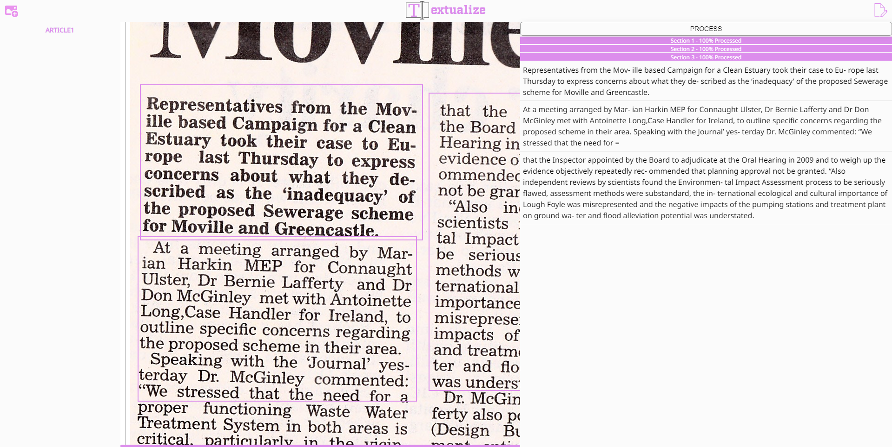

#  [Textulaize.app](https://textualize.app)

[💗 Support this Extension 💗](https://github.com/sponsors/joshuashoemaker/)

With textualize you can images of newspaper articles, books, and other documents into text, all within your browser. 

You can add several images to your workspace. On each image you can draw a rectangle around each section of text you with to textualize. Select the icon on the top left to open the preview, then select process and watch it go!

This tool was develop to provide a free and easy tool for digitizers and archivist. Have fun! 😊